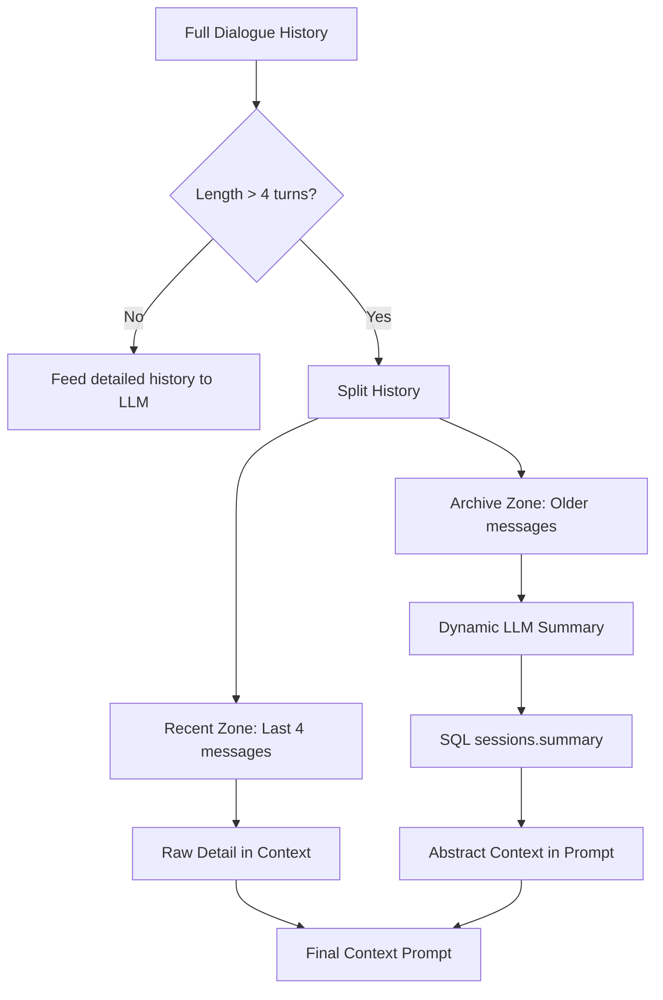

# Hybrid Memory Architecture (Chat Memory & Summarization)

This document details the architectural design and implementation findings of the **Hybrid Memory Manager** designed to handle long-term context retention while strictly bounding token consumption.

---

## 1. The Challenge: Context Window Bloat
In conversational RAG pipelines, keeping the LLM aware of the discussion history is critical for resolving pronouns (e.g. *"how much is that?"* or *"where is it located?"*).
* **Naive Approach**: Appending every single past user/assistant dialogue turn directly to the prompt context.
* **The Penalty**: Drains the LLM context window, increases latency, and exponentially escalates API token costs as conversations grow.

---

## 2. The Solution: Hybrid Memory Segmentation
We implement a hybrid memory approach that divides dialogue history into two distinct zones:



### 1. Detailed Sliding Window (Recent Zone)
* **Scope**: The last `4` messages (2 complete exchanges between the user and assistant).
* **Purpose**: Retains high-fidelity details (exact phrasing, current topic references, specific numeric outputs) for immediate context.

### 2. Dynamic Abstract Summary (Archive Zone)
* **Scope**: All messages preceding the detailed sliding window.
* **Purpose**: Synthesizes the long-term context of the conversation into a single, cohesive paragraph (under 80 words) using a background LLM summarization call.
* **Persistence**: Saved directly to the `summary` column in the SQLite `sessions` table to prevent re-summarizing old messages.

---

## 3. Data Flow
1. **Request Received**: The `/api/chat` endpoint is called with a `session_id` and `user_id`.
2. **History Retrieval**: The server queries the SQLite database for the session's active summary and full message history.
3. **Partitioning**:
   - If the message log is larger than 4 entries, the older entries are extracted.
   - The server triggers a background LLM request to update the running conversation summary:
     ```python
     new_summary = generate_updated_summary(old_summary, older_messages, user_api_key)
     ```
   - The updated summary is committed back to the database.
4. **Prompt Construction**: The LangGraph state passes both `state.summary` and `state.history` to `node_answer`, producing the final prompt:
   ```text
   Summary of previous conversation:
   [Abstract Summary of older messages]

   Recent conversation history:
   User: [Msg -3]
   Assistant: [Msg -2]
   User: [Msg -1]
   Assistant: [Msg 0]

   [MBCET Prospectus Data Context Excerpts]

   Current Question: [User message]
   ```
5. **LLM Execution**: The prompt is processed by Groq using the user's custom API key.
